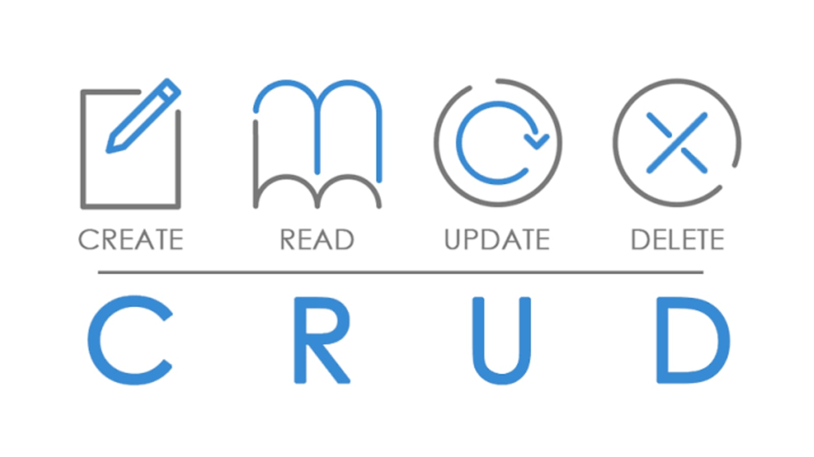

# CRUD-PHP

A continuación crearemos un proyecto completo de CRUD con PHP y MYSQL, luego gestionaremos el acceso con sesiones desde la tabla usuario.
Realizando CRUD (Create, Read, Update and Delete)
